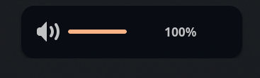

# Configuration Hyprland - Version 2

> [Installation manuelle](INSTALLATION-MANUELLE.md) · [Raccourcis clavier](KEYBINDINGS.md)

## Composants principaux

| Composant | Utilisation                       |
| --------- | --------------------------------- |
| Hyprland  | Gestionnaire de fenêtres          |
| Waybar    | Barre d'état                      |
| SwayNC    | Centre de notifications           |
| SwayOSD   | Indicateurs volume/luminosité     |
| Hyprlock  | Verrouillage d'écran              |
| Hypridle  | Gestionnaire d'inactivité         |
| Yazi      | Gestionnaire de fichiers terminal |
| Tofi      | Lanceur d'applications            |
| Kitty     | Terminal                          |
| Micro     | Éditeur texte ligne de commande   |
| Fastfetch | Informations système              |
| Thème     | Catppuccin Mocha                  |
| Icônes    | Papirus Icon Pack                 |
| Pywal-16  | Génération de couleurs            |
| Pywalfox  | Thème Firefox dynamique           |
| wlogout   | Menu d'arrêt Wayland              |

---

## Structure de configuration Hyprland

### Organisation des fichiers

```
~/.config/hypr/
├── hyprland.conf          
├── hypridle.conf          
├── hyprlock.conf          
├── colors_temp.conf       
├── configs/
│   ├── env.conf           
│   ├── input.conf         
│   ├── autostart.conf     
│   ├── keybindings.conf   
│   ├── look.conf          
│   ├── monitors.conf     
│   ├── plugins.conf       
│   └── windowrules.conf   
└── colors/
    └── hyprlock-colors.conf 
```

### Import des configurations

```
source = configs/env.conf
source = configs/input.conf
source = configs/autostart.conf
source = configs/keybindings.conf
source = configs/look.conf
source = configs/monitors.conf
source = configs/plugins.conf # Plugins non utilisé
source = configs/windowrules.conf
```

---

## Waybar 

### Fichiers de configuration

```
~/.config/waybar/
├── config                 
└── style.css              
```


---

## Tofi 

### Fichiers de configuration

```
~/.config/tofi/
└── config                 
```

---

## SwayNC 
### Fichiers de configuration

```
~/.config/swaync/
├── config.json            
└── style.css              
```

---

## SwayOSD




```
~/.config/swayosd/
├── config.toml            # Paramètres (appareils suivis, commandes associées)
└── style.css              # Styles (couleurs, typographie, ombres)
```

---

## Hyprlock
### Fichiers de configuration


```
~/.config/hypr/
└── hyprlock.conf          
```

---

## Hypridle 
### Fichiers de configuration

```
~/.config/hypr/
└── hypridle.conf          
```

---

## Wlogout


### Fichiers de configuration

```
~/.config/wlogout/
├── layout                   
├── style.css                
└── icons/                   
```


---

## Kitty 


### Fichiers de configuration

```
~/.config/kitty/
├── kitty.conf             # Configuration principale
└── colors.conf            # Couleurs et thème
```

---

## Pywal-16


### Fichiers de configuration

```
~/.cache/wal/
├── colors.json            # Palette de couleurs
├── colors.sh              # Script shell
└── colors.css             # Styles CSS
```

---

## Fastfetch 


### Fichiers de configuration

```
~/.config/fastfetch/
├── config.jsonc           # Configuration principale
└── logo/                  # Logos personnalisés
    ├── akatsuki.png       # Logo Akatsuki
    ├── itachi.png         # Logo Itachi
    └── sasukeyyy.png      # Logo Sasuke
```

---

## Scripts - Scripts personnalisés

Collection de scripts personnalisés.

### Fichiers de configuration

```
~/.config/Scripts/
```

---

## Spicetify

Personnalisation de Spotify via Spicetify (`spicetify-cli` + `spicetify-marketplace-bin`).  
Consulter [INSTALLATION-MANUELLE.md](INSTALLATION-MANUELLE.md) pour les étapes de configuration et l'accès au Marketplace intégré.
